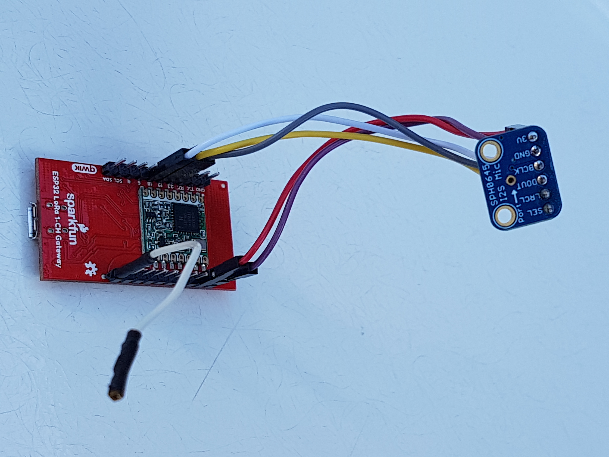
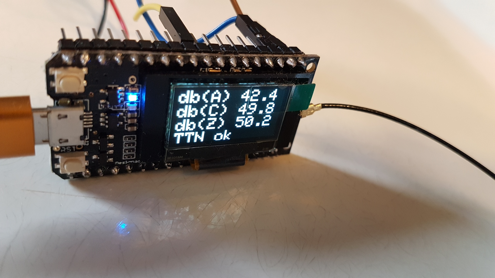

## LoRaSoundkit
#### Open source (hardware) sound level meter for the internet of things.

* [General](#General)
* [Electronic components assembly](#electronic-components-assembly)
* [Board configuration](#Board-configuration)
* [Libraries](#Libraries)
* [Config file](#Config-file)
* [Specification](#Specification)
* [Example graphical output Sound Kit](#Example-graphical-output-Sound-Kit)

## General

This Soundkit sensor measures continuously audible sound by analyzing the data using FFT. The results are send each minute to the LoRa network. The sensor measures  audible spectrum from 31.5 Hz to 8 kHz divided in 9 octaves. Also each minute the average, minimum and maximum levels are calculated for the 3 weighting curves dB(A), dB(C) and db(Z).



> Sound Kit Sparkfun board


> Sound Kit TTGO board



> Sound Kit TTGO OLED display

## Electronic components assembly
The software is based on ESP32 processor with Lora module. Two boards has been tested viz. Sparkfun LoRa board and TTGO LoRa board.
The TTGO LoRa  board does have an OLED display, and will display the average dB(A), dB(C) and dB(z) levels.

#### Components
* Sparkfun LoRa Gateway 1-channel ESP32 (used as Sensor), or TTGO LoRa32 V1
* I2S MEMS microphone SPH046 or I2S MEMS microphone NMP441
* antenna ¼ lambda, e.g a wire of 8.4 cm length or 868MHz Helical Antenna
* power adapter 5V, 0.5A

The table below shows the wiring between MEMS microphone (SPH0645 or NMP443) and the processor board (Sparkfun or TTGO):
| SPH0645 | NMP442 |  |Sparkfun| TTGO |
| ------- | ------ |--|--------|-------|
| 3V | 3V |  <--> | 3V | 3V |
| GND | GND |  <--> | GND | GND|
| BCLK | SCK |  <--> | GPIO18 | GPIO13 |
| DOUT | SD |  <--> | GPIO19 | GPIO35 |
| LRCL | WS  |  <--> | GPIO23 | GPIO12 |
|      | LR  |  GND |   |   |
| SEL  |     |  not connected |   |   |

#### N.B.
For sound measurements lower then 30 dB, the supply to the MEMS microphone must be very clean. The 3V supplied by the Sparkfun ESP gives in my situation some rumble in low frequencies. It can be uncoupled by extra 100nf and 100 uF or a separate 3.3V stabilzer.

## Board configuration
Install ESP32 Arduino Core
Add the line in Arduino→preferences→Additional Boardsmanagers URL:
```
	https://dl.espressif.com/dl/package_esp32_index.json
```
Restart Arduino environment.

In the Arduino menu Tools→Boards, choose your board you want to use:
* Select TTGO LoRa32-OLED V1 board or
* Select Sparkfun LoRa Gateway 1-Channel board

The Sounkit sourcecode supports both boards. If Sparkfun Lora gateway is not vissible check the presence of the Sparkfun variant file, see instructions at https://learn.sparkfun.com/tutorials/sparkfun-lora-gateway-1-channel-hookup-guide/programming-the-esp32-with-arduino <br>


## Libraries

#### LMIC
There are several LIMC LoRaWan libraries. I use the LMIC library from MCCI-Catena, because this one is currently best maintained. 
Download the library from https://github.com/mcci-catena/arduino-lmic and put it in your <arduino-path>\libraries\
	
Take care that you change the frequency plan to Europe (if you are in Europe), because it is defaulted to the US. It can be changed in the file <arduino-path>\arduino-lmic-master\project_config\lmic_project_config.h
```
#define CFG_eu868 1
```
#### Arduino FFT
I used the https://www.arduinolibraries.info/libraries/arduino-fft library.
The two files “arduinoFFT.h” and arduinoFFT.ccp” are already in your .ino main directory

## Config file
In the config.h define some parameters.
#### Cycle count
The cycle count defines how often a measurement is sent to the thingsnetwork in msec.:
```
#define CYCLECOUNT   60000 
```
#### LoRa TTN keys
The device address and keys have to be set to the ones generated in the TTN console. Login in the TTN console and add your device.
Choose activation mode OTAA and copy the APPEUI, DEVEUI and APPKEY keys into this config file:
```
#define APPEUI "0000000000000000"
#define DEVEUI "0000000000000000"
#define APPKEY "00000000000000000000000000000000"
```

## Specification

#### Sound Measuerment
* sample frequency  MEMS microphone 22.628 khz
* 18 bits per sample 
* soundbuffer 2048 samples
* FFT bands in bins of 11 Hz (22628 / 2048)
* measurement cycle time 90 msec
* one measurement contains
  * spectrum 31.5Hz, 63Hz, 123Hz, 250Hz, 500 Hz, 1kHz, 2kHz, 4kHz and 8kHz
  * average, maximum and minimum level

#### Interface
Every minute a message is composed from all measurements done in one minute, which contains the following values in dB.
* 9 spectrum levels for dB(A)
* 9 spectrum levels for dB(C)
* 9 spectrum levels for dB(Z)
* min, max, and average levels for dB(A)
* min, max, and average levels for dB(C)
* min, max, and average levels for dB(Z)

The message is send in a compressed binary format to TTN. The TTN payload decoder converts the messsage to a readable JSON message.

#### Example of a JSON message:
```
  "la": {
    "avg": 44.2,
    "max": 50.4,
    "min": 39.8,
    "spectrum": [
      22.2,
      30.4,
      37.1,
      36,
      35,
      35.3,
      34.3,
      37.4,
      30.5
    ]
  },
  "lc": {
    "avg": 61.3,
    "max": 72.5,
    "min": 49.5,
    "spectrum": [
      58.6,
      55.8,
      53,
      44.6,
      38.2,
      35.3,
      33.3,
      36.6,
      28.6
    ]
  },
  "lz": {
    "avg": 63.4,
    "max": 75.1,
    "min": 50.3,
    "spectrum": [
      61.6,
      56.6,
      53.2,
      44.6,
      38.2,
      35.3,
      33.1,
      36.4,
      31.6
    ]
  }
}
```
## Example graphical output Sound Kit
Below a graph of a sound measurement in my living room in dB(A).
In this graph some remarkable items are vissible:
* blue line shows the max level of the belling comtoise clock each half hour
* visible noise of the dishing machine from 0:30 to 1:30
* noise of of the fridge the 125 Hz line
* incrementing outside traffic (63 Hz) at 7.00


The green blocks shows the average spectrum levels.
This graph is made with Nodered, InfluxDb and Grafana.

