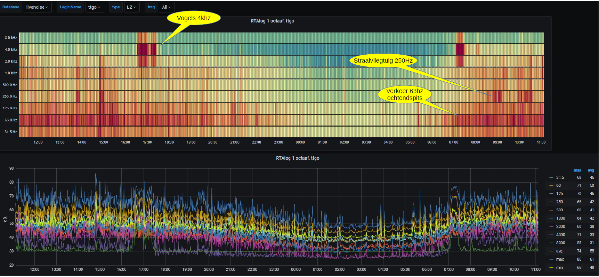

## LoRaSoundkit
#### Open source (hardware) sound level meter for the internet of things.

* [General](#General)
* [Electronic components assembly](#electronic-components-assembly)
* [Board configuration](#Board-configuration)
* [Libraries](#Libraries)
* [Config file](#Config-file)
* [Specification](#Specification)
* [Test Report](#Test-Report)
* [Example graphical output Sound Kit](#Example-graphical-output-Sound-Kit)
* [Last Updates](#Last-Updates)
* [To Do](#To-Do)

## General
This Soundkit is easy to build for a low cost price (ca. 40 euro) and is therefore very suitable to be used for citizen sensing.

This sensor measures continuously audible sound by analyzing the data using FFT process. The measured results are send in a report at regular time intervals to the LoRaWan network, where it can be picked up for visualization.

No adjustments are needed, because the sensor uses a digital MEMS microphone. which is factory calibrated. Furthermore it can easily be connected to the community network, viz. it is independent of a home or office network.

The sensor make use of the powerful ESP32 processor, which is a dual core processor. One core handles continuously the processing of audio, while the other core handles the LoRaWan communication.

The sensor measures  audible spectrum from 31.5 Hz to 8 kHz divided in 9 octaves. Each regular time interval the average, minimum and maximum levels are calculated for the 3 weighting curves dB(A), dB(C) and db(Z).


> Sound Kit TTGO OLED display

Several MEMS microphones can be used, the Soundkit is tested with SPH0645 and ICS43434.
The ICS43434 is adviced by Sensor.community, because the small headerboard can be assembled in a half inch pipe (13mm) fillled with resin in order to minimize audio resonance. Sound calibrators uses also this diameter size.


> ICS43434 in pipe filled with resin

## Electronic components assembly
The software is based on TTGO LoRa T3 board, this board includes a ESP32 processor, a Lora RFM95 module, LoRa antenna.
The TTGO LoRa  board does have an OLED display, and will display the average dB(A), dB(C) and dB(z) levels.

Several MEMS microphones can be connected SPH0645 or ICS43434
The SPH0645 was slightly better in low frequencies. This is more important if you want to measure dB(C) and dB(Z) levels.
The ICS43434 is better in low levels, less noise. 
 
#### Components 
- Processor board: LilyGO TTGO T3 LoRa32
- I2S Microphone: SPH0645 or ICS43434
- power adapter 5V, 0.5A

The table below shows the wiring between MEMS microphone (SPH0645 or ICS43434) and the processor board TTGO:
| SPH0645 | ICS43434|       | TTGO T3|
| ------- | ------ | ------ |--------|
| 3V      |  3V    |  <-->  | 3V     |
| GND     |  GND   |  <-->  | GND    |
| BCLK    |  SCK   |  <-->  | GPIO00 |
| DOUT    |  SD    |  <-->  | GPIO35 |
| LRCL    |  WS    |  <-->  | GPIO12 |
|         |  LR    |        | GND    |
| SEL     |        |        |not connected|   |

**Remark 1:**

The length of the wires between MEMS and TTGO-board should not exceed 15 cm and tie the wires close to each other, or use a 5 wire flat cable.

**Remark 2**

For sound measurements lower then 30 dB, the power to the MEMS microphone must be very clean. The 3.3V supplied to the MEMS can cause some rumble in low frequencies. It can be improved by placing an extra 100nf and 100 uF capacitor in parallel.

## Board configuration
**PlatformIO**
The platformio.ini file is configured for the LilyGO TTGO T3 LoRa32 board.
```
[env:ttgo-lora32-v21]
```
## Libraries

Libraries and macros are defined in platformio.ini and are installed automatically. The library uses are
espressif32 3.5.0, mcci-catena/MCCI LoRaWAN LMIC library@ 4.1.1, adafruit/Adafruit GFX Library and adafruit/Adafruit SSD1306

#### LMIC
Take care that you change the frequency plan to Europe (if you are in Europe), because it is defaulted to the US. It can be changed in the file .pio\libdeps\ttgo-lora32-v21\MCCI LoRaWAN LMIC library\project_config\lmic_project_config.h
```
#define CFG_eu868 1
```
and the line 
```
#define hal_init LMICHAL_init
```
#### Arduino FFT
I used the https://www.arduinolibraries.info/libraries/arduino-fft library.
The two files “arduinoFFT.h” and arduinoFFT.ccp” are already present in your source directory.

## Config file
In the config.h some parameters are defined.
#### CycleTime
The cycle count defines how often a measurement is sent to the thingsnetwork in seconds:
```
#define CYCLETIME   60
```
For RIVM and sensor.community use 150

Set microphone dependent correction in dB
```
#define MIC_OFFSET 0.0
```
for SPH0645 use -1.8</br>
for ICS43434 use 1.5</br>
otherwise use 0.0


#### LoRa TTN keys
TTN V2 stops at the end of 2021, so my advice is use the TTN console V3 to set your keys.  
Register your device, choose 'manually' and MAC version 1.03.
Choose activation mode OTAA and copy the the (generated) APPEUI and APPKEY keys into this config file (config,h):
```
#define APPEUI "0000000000000000"
#define APPKEY "00000000000000000000000000000000"
```
Note that unique DEVEUI is read from the TTGO ESP32 board id. The DEVEUI is displayed in the TTGO log during startup and is displayed on the OLED display. This value must be entered in the TTN console in the field DEVEUI.

## Specification

#### Sound Measurement
* Accuracy < 1 dB
* sample frequency MEMS microphone 22.628 kHz
* 18 bits per sample 
* soundbuffer 2048 samples
* FFT bands in bins of 11 Hz (22628 / 2048)
* measurement cycle time 90 msec
* one measurement contains
  * spectrum 31.5Hz, 63Hz, 123Hz, 250Hz, 500 Hz, 1kHz, 2kHz, 4kHz and 8kHz
  * average, maximum and minimum level

## Test Report
The [test report can be found HERE](test/Test-report-TTGO-LoRa-Soundkit.pdf)  
The test report desribes the tests of the Soundkit together with the Teensy4 soundsensor of the Sensor Community Germany.  
Three test sets are used and the results are compared. The sets are:
- Soundkit LoRa TTGO with ICS43434
- Soundkit LoRa TTGO with SPH0645
- Soundsensor Teensy4 of the Sensor Community Germany.

The tests are executed with certified class 1 calibrator and soundlevel meter.

#### Interface
Every interval time (e.g. each minute) a message is composed from all measurements done in one interval, which contains the following values in dB.
* 9 spectrum levels for dB(A)
* 9 spectrum levels for dB(C)
* 9 spectrum levels for dB(Z)
* min, max, and average levels for dB(A)
* min, max, and average levels for dB(C)
* min, max, and average levels for dB(Z)

The message is send in a compressed binary format to TTN. The TTN payload decoder converts the message to a readable JSON message.

#### Example of a JSON message:
```
  "la": {
    "avg": 44.2,
    "max": 50.4,
    "min": 39.8,
    "spectrum": [
      22.2,
      30.4,
      37.1,
      36,
      35,
      35.3,
      34.3,
      37.4,
      30.5
    ]
  },
  "lc": {
    "avg": 61.3,
    "max": 72.5,
    "min": 49.5,
    "spectrum": [
      58.6,
      55.8,
      53,
      44.6,
      38.2,
      35.3,
      33.3,
      36.6,
      28.6
    ]
  },
  "lz": {
    "avg": 63.4,
    "max": 75.1,
    "min": 50.3,
    "spectrum": [
      61.6,
      56.6,
      53.2,
      44.6,
      38.2,
      35.3,
      33.1,
      36.4,
      31.6
    ]
  }
}
```
## Example graphical output Sound Kit
Below a heatmap and graph of a sound measurement on my balcony in quiet residential area. The values shown are in dB(Z)
In this graph some remarkable items are vissible:
* birds at 4khz at sunrise and sunset
* jet airplane at 250 Hz
* morning rush (traffic) at 63 Hz
Note that db(Z) levels shows a lot of noise in low frequencies, which is mostly not vissible in common db(A) measuremnts.



This graph is made with Nodered, InfluxDb and Grafana.

## Last Updates
Changed 18-3-2024
- Sources adapted for LilyGO TTGO T3 LoRa32 board (10dB better radio performance)
- Sources adapted for VC PlatformIO (arduino IDE support not tested)
- During a TTN connect phase, the I2S MEMS driver is stopped, because it gives Rx radio interference
- The update of the OLED display is moved from the sound thread to the main thread.

Changed 15-8-2021
  - MCCI Catena LoRa stack
  - Worker loop changed (hang situation solved with TTN V3)
  - OLED display added
  - DEVEUI obtained from BoardID, (same SW for multiple sensors)
  - use the TWO processor cores of ESP (one core for audio and one core for LoRa)
  - DC offset MEMS compensated by moving average window
  - payload compressed from 27 to 19 bytes
  - test report added
  
## To Do
Advice for sensor housing and microphone placement.

